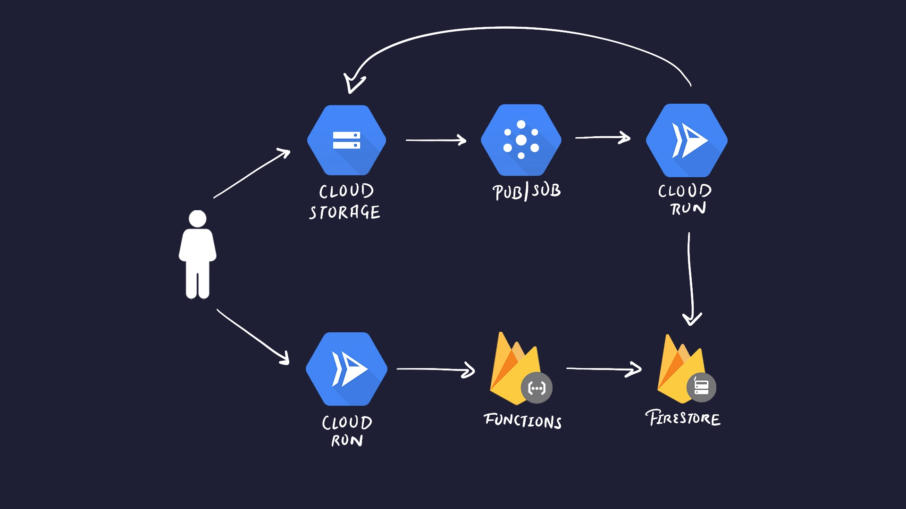

# 🎥 YouTube Clone Project

A YouTube-like platform where users can upload, view, and interact with videos. The system transcodes uploaded videos and stores them for playback.

## 🚀 Features

- **List Videos:** Browse a list of uploaded videos.
- **Watch Video:** Play videos directly in the browser.
- **Sign In/Out:** User authentication using Firebase Auth.
- **Upload Video:** Upload videos for transcoding and storage.
- **Watch Transcoded Video:** View uploaded videos after processing.

## 🛠 Tech Stack

- **Frontend:** TypeScript, Next.js
- **Backend:** Express.js, Docker, Firebase Functions
- **Video Processing:** FFmpeg
- **Storage & Database:** Firebase Firestore, Google Cloud Storage
- **Messaging:** Google Cloud Pub/Sub
- **Hosting:** Google Cloud Run

## 🏗️ Architecture

1. **Google Cloud Storage:** Stores raw and processed videos in separate buckets.
2. **Google Cloud Pub/Sub:** Handles messaging between video upload and processing services.
3. **Google Cloud Run:** Hosts the video processing service (for transcoding) and the Next.js web client.
4. **Firebase Firestore:** Stores video metadata such as titles, descriptions, and video file references.
5. **Firebase Functions:** Provides the API backend for video fetching and authentication.

## 🔧 How It Works

1. **Upload Video:** Users upload raw videos via the web client. These videos are stored in Cloud Storage, and a message is sent to Pub/Sub to trigger the transcoding process.
2. **Transcoding:** The video processing service receives the Pub/Sub message and transcodes the video using FFmpeg. The processed video is uploaded to Cloud Storage.
3. **Metadata Storage:** Video metadata, including references to both raw and processed videos, is stored in Firebase Firestore.
4. **Playback:** The Next.js app retrieves video metadata from Firestore and streams the processed video from Cloud Storage for playback.
